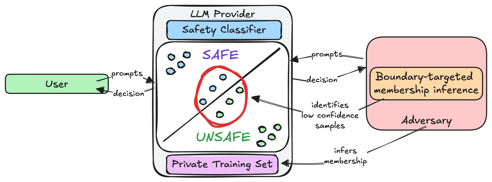

# Boundary-targeted Membership Inference Attacks on Safety Classifiers

AI safety classifiers do important work like flagging harmful content and identifying at-risk users in LLM interactions. But what happens if they are trained on sensitive data (mental health conversations, self-harm discussions)? 

This repo explores that question through **membership inference attacks (MIAs)**. MIAs are techniques that let an adversary determine whether a specific example was used to train a model.




## What's new here?

We introduce a **boundary-targeted selection strategy** that focuses on examples where the classifier is least confident. These low-confidence "boundary" examples reflect memorisation — the model's way of resolving ambiguity — and it turns out they're a goldmine for adversaries.

## Key result

> An adversary can recover **19% of flagged distress conversations** at a 5% false-positive rate — **3.5× better** than state-of-the-art MIA methods alone.

## Takeaways

- We struggled to do content-based filtering of these boundary examples.
- Existing noise-based strategies **can** meaningfully reduce exposure, but they come with trade-offs in utility.
- Paraphrasing was a surprisingly effective defense, and maintained utility better than noise-based methods.
- The privacy risks of safety classifiers deserve more attention than they're getting.

### Datasets

| Dataset | Task | Examples |
|---------|------|----------|
| BeaverTails Binary | safe vs unsafe | ~8,000 |
| BeaverTails Multiclass | 15-category harm | ~8,000 |
| XGuard Multi-turn | safe vs jailbreak | ~8,000 |
| ESConv (Liu et al., 2021) and Psychotherapy Eval (Steenstra et al., 2026) | support-needed vs benign | ~800 |
| Pooled | BT + XGuard + ES combined | ~20,000 |

### Attacks

| Attack | Signal | Reference |
|--------|--------|-----------|
| **Loss-based** | Negative cross-entropy loss | Yeom et al. 2018 |
| **Reference model** (LiRA-style) | Log-ratio of target vs reference loss | Carlini et al. 2022 |
| **Logit vector** | Logistic regression probe on full logit distribution | Shokri et al. 2017 |


### Get Started

```bash
pip install -r requirements.txt
python data_prep.py --dataset beavertails
python finetune.py --model_size 1b --split all
python membership_inference.py --classifier all
python analyze.py
```

## Project Structure

```
├── config.py                  # Model names, paths, hyperparams
├── data_prep.py               # Dataset loading, splitting, canary injection
├── finetune.py                # LoRA / full fine-tuning of safety classifiers
├── membership_inference.py    # MIA attacks and metric computation
├── analyze.py                 # Plots and summary generation
├── analysis/                  # Results write-ups, tables, and plots
├── data/                      # Created by data_prep.py
└── results/                   # Sweep outputs, CSVs, and figures
```

## License

MIT — see [LICENSE](LICENSE).

